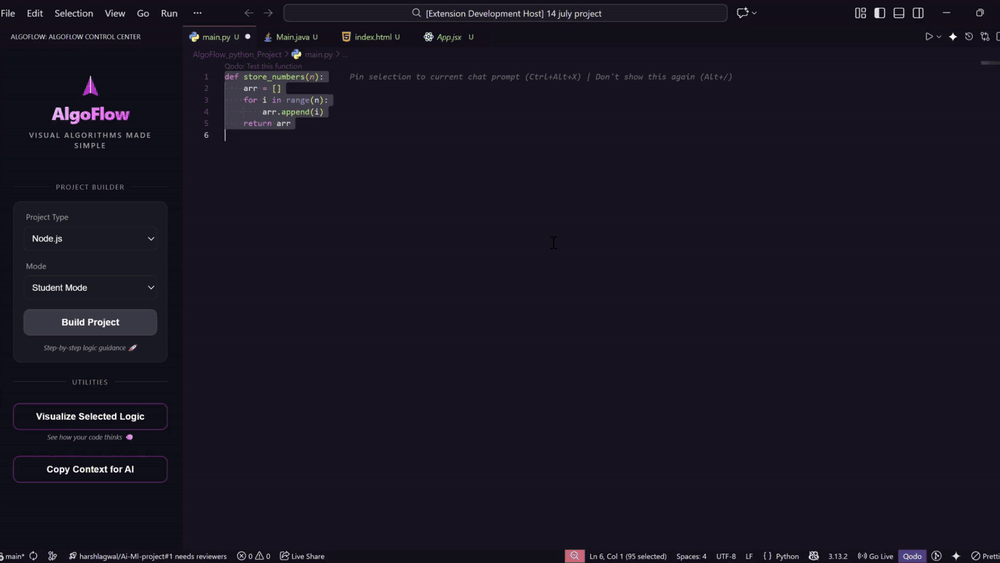
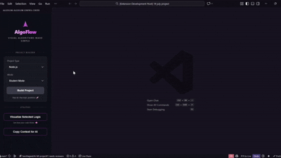

# 

## 🚀 Visualize Your Logic, Master Your Algorithms

**AlgoFlow** is an open-source VS Code extension built for **students, beginners, and B.Tech freshers** who want to stop "guessing" how their code works and start *seeing* it.

Whether you're struggling with nested loops, recursion, or just want to understand the flow of a new script, AlgoFlow transforms your static code into **dynamic, step-by-step flowcharts** and provides a **Complexity Intelligence Engine** to help you write professional-grade code from day one.

---

## 🎥 Demo Videos (AlgoFlow in Action)

### 1. Visualize Selected Logic

*Instantly transform any code selection into an interactive flowchart. Watch how the execution moves through conditions and loops in real-time.*

### 2. Build Projects with Confidence

*Seamlessly integrate AlgoFlow into your development workflow. See how it handles multi-file structures and project-wide logic visualization.*

### 3. Complexity Intelligence Engine

*Get instant Big-O analysis for your code. Our student-friendly engine explains not just the 'what' (Time & Space complexity) but also the 'why'.*

---

## ✨ Key Features

- 🎨 **Real-Time Flowcharts**: Select any block of code and generate a clean, professional flowchart instantly.
- 🧠 **Student-First Explanations**: Features a friendly "Teacher Persona" avatar that explains logic in plain English, perfect for clearing those "Ohhh, now I get it!" moments.
- 📊 **Complexity Intelligence**: Automatic analysis of Time and Space complexity ($O(n)$, $O(log n)$, etc.) with simplified reasoning.
- 🕹️ **Execution Control**: Play, Pause, and Step through your code logic at your own pace.
- 🐍 **Multi-Language Support**: Works out of the box with **Python, Java, C++, C, JavaScript, and React**.
- 📥 **Export for Assignments**: Download your flowcharts as high-quality SVGs to include in your lab reports or presentations.

---

## 🎓 Who is AlgoFlow for?

- **CS Students** tackling Data Structures and Algorithms (DSA) for the first time.
- **B.Tech Freshers** preparing for coding interviews and technical rounds.
- **Self-Taught Developers** who want a visual way to debug complex logic.
- **Educators** looking for a tool to demonstrate code execution to students.

---

## 🛠️ How to Use

1. **Select** a snippet of code (functions, loops, or logic blocks).
2. **Right-click** and choose `AlgoFlow: Visualize Code Selection`.
3. Use the **Sidebar Control Center** to play the animation or step through line-by-line.
4. Check the **Complexity Sticky Note** for Big-O insights.

---

## 🏛️ Marketplace & Privacy

- 💰 **100% Free**: No subscriptions, no hidden costs.
- 📡 **Offline First**: Works entirely on your local machine—no code ever leaves your editor.
- 🚀 **Lightweight**: Fast performance without slowing down your VS Code experience.

---

**Built with ❤️ for the student community by [Harsh Lagwal](mailto:harshlagwal123@gmail.com)**

