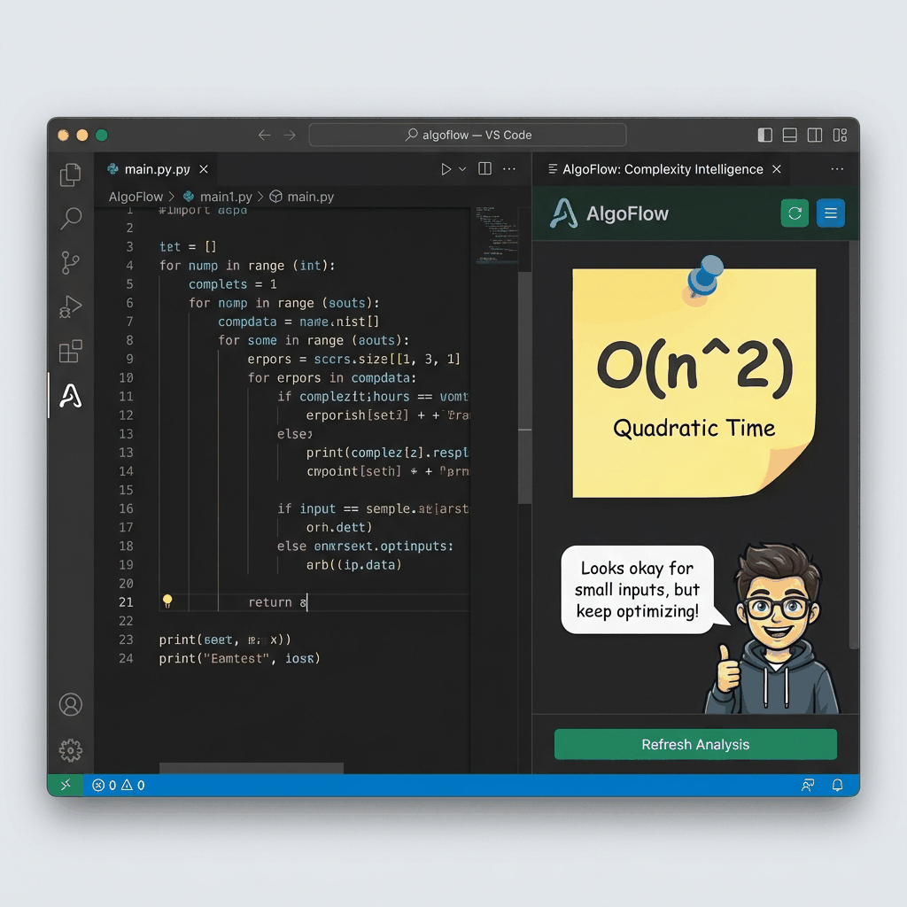

# AlgoFlow
### Visual Algorithms Made Simple

**AlgoFlow** is a powerful educational tool designed to help students and beginners master algorithms by seeing them in action. We transform complex logic into clear, animated flowcharts that bridge the gap between abstract code and visual understanding.

Turn code into visual flowcharts directly inside VS Code.  
Perfect for students, debugging, and learning algorithms visually.

## 🚀 Quick Start
1. Select any code in your editor  
2. Right-click → AlgoFlow: Visualize Code Selection  
3. Watch your logic turn into a step-by-step flowchart  

---

## ✨ Features

- **Visualize Algorithms**: Instantly convert code selections into interactive, animated flowcharts.
- **Step-by-Step Execution**: Trace your logic line-by-line to see exactly how variables change and control flows.
- **Loop Visualization**: Intuitively understand repetition with animated back-edges and iteration tracking.
- **Complexity Analysis**: Built-in intelligence to identify Big-O notation (O(1), O(n), O(n²), etc.) for Time and Space.
- **Broad Language Support**: Works seamlessly with **Python, Java, C, C++, JavaScript, TypeScript, and R**.
- **Beginner-Friendly**: Includes plain-English explanations and a "Teacher Persona" to guide you through complex logic.

---

## 🎬 See AlgoFlow in Action

### 1. Visualize Your Logic

*Select any block of code and watch it transform into a step-by-step flowchart.*

### 2. Smart Project Builder

*Start new learning projects instantly with pre-configured structures for different languages.*

### 3. Complexity Intelligence

*Understand the efficiency of your code with automatic Big-O analysis and educational reasoning.*

---

## 🚀 Installation

AlgoFlow is available directly from the **VS Code Marketplace**:

1. Open VS Code.
2. Go to the **Extensions** view (`Ctrl+Shift+X`).
3. Search for **"AlgoFlow"**.
4. Click **Install**.

---

## 🛠️ Usage

Mastering your algorithms is just a few clicks away:

1. **Select** a snippet of code in your editor (e.g., a loop, a function, or a logic block).
2. **Right-click** on the selection.
3. Choose **"AlgoFlow: Visualize Code Selection"**.
4. Use the **Sidebar Control Center** to play, pause, or step through the flowchart.
5. Check the **Complexity Sticky Note** for Big-O insights.

---

## 🏛️ Branding & Vision

AlgoFlow is **Built for Students & Beginners**. Our vision is to make computer science more approachable by providing tools that focus on the "Why" behind the logic. Every feature is designed with a learning-first mindset.

---

**Built with ❤️ for the student community by Harsh Lagwal**

### 📬 Connect with Me

